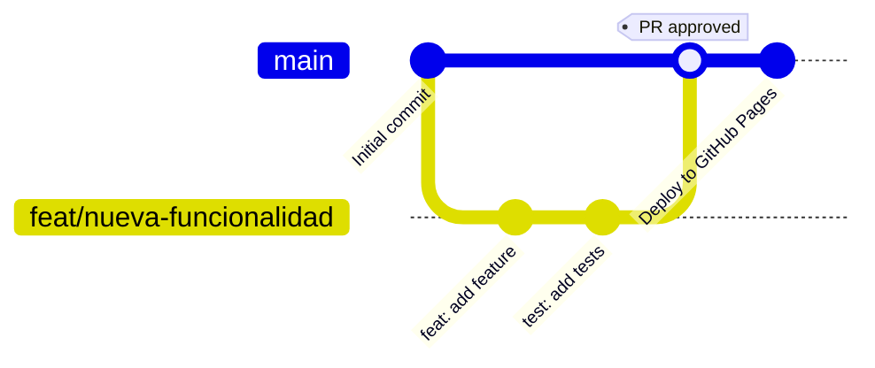

# Star Realms Counter 🌌

Contador web para el juego de cartas Star Realms con soporte para 1-4 jugadores.

## Características

- ✨ Soporte para 1-4 jugadores
- 🎯 Contadores de Authority, Combat y Trade
- 🔄 Reset de turno (Combat/Trade)
- 🎮 Nueva partida (resetea todo)
- 📱 Diseño responsive
- 🌌 Temática espacial

## Conventional Commits

Este proyecto usa [Conventional Commits](https://www.conventionalcommits.org/) para generar el CHANGELOG automáticamente.

**Formato de commits:**
```
<type>(<scope>): <subject>
```

**Tipos:**
- `feat`: Nueva funcionalidad
- `fix`: Corrección de bug
- `docs`: Cambios en documentación
- `style`: Cambios de formato (no afectan el código)
- `refactor`: Refactorización de código
- `perf`: Mejoras de rendimiento
- `test`: Agregar o modificar tests
- `chore`: Tareas de mantenimiento

**Ejemplos:**
```bash
git commit -m "feat: add player selector for 1-4 players"
git commit -m "fix: prevent negative combat values"
git commit -m "docs: update README with deployment instructions"
```

**Generar nueva versión y CHANGELOG:**
```bash
npm run release
```

## Desarrollo Local

```bash
npm install
npm run dev
```

## Workflow de Desarrollo



1. Crear rama desde main: `git checkout -b feat/nueva-funcionalidad`
2. Hacer cambios y commits siguiendo Conventional Commits
3. Push de la rama: `git push origin feat/nueva-funcionalidad`
4. Abrir Pull Request en GitHub
5. Esperar aprobación del Code Owner (@MLMontechiari)
6. Merge a main → Deploy automático a GitHub Pages

## Deployment

El proyecto se despliega automáticamente a GitHub Pages mediante GitHub Actions en cada push a `main`.

**URL**: https://mlmontechiari.github.io/star-realms-counter

## Tecnologías

- React 19
- TypeScript
- Vite
- Atomic Design Pattern

## Estructura del Proyecto

```
src/
├── components/
│   ├── atoms/        # Componentes básicos (Button, Input, Modal)
│   ├── molecules/    # Combinaciones (Counter, PlayerSelector, TurnActions)
│   └── organisms/    # Secciones completas (PlayerCard)
├── App.tsx           # Template principal
└── App.css           # Estilos globales
```
